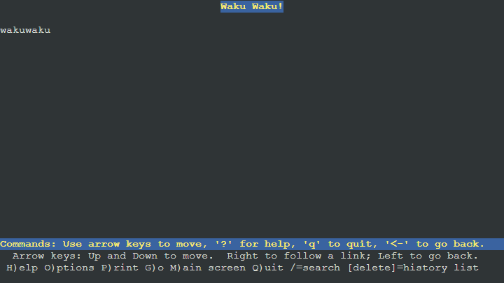
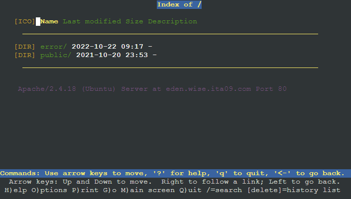
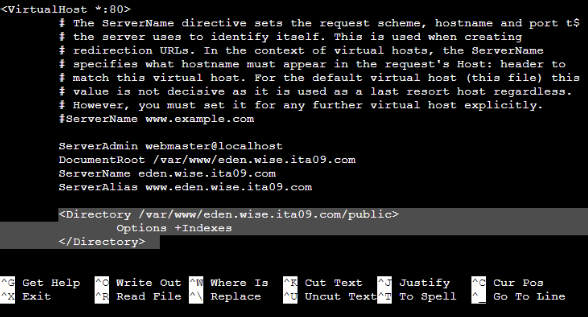

# Jarkom-Modul-2-ITA09-2022

**Rayhan Kurnia Alunantara Wijaya 5027201030**		

**Mummmad Alwan  5027201019**

**Pembagian Pengerjaan Lapres**
**Rayhan Kurnia Alunantara Wijaya 5027201030 Mengerjakan Nomor 1-8**		
**Mummmad Alwan  5027201019 Mengerjakan Nomor 8-12**		

1. WISE akan dijadikan sebagai DNS Master, Berlint akan dijadikan DNS Slave, dan Eden akan digunakan sebagai Web Server. Terdapat 2 Client yaitu SSS, dan Garden. Semua node terhubung pada router Ostania, sehingga dapat mengakses internet

Jawaban

Cara untuk menyelesaikan nomor ini cukup hanya dengan melakukan konfig yang diajarkan di modul gns3. Uncomment line eth3 agar dapat mengakses internet. Lakukan hal yang sama untuk eth0 di WISE.

2. Untuk mempermudah mendapatkan informasi mengenai misi dari Handler, bantulah Loid membuat website utama dengan akses **wise.yyy.com** dengan alias **www.wise.yyy.com** pada folder wise

Jawaban

PERCOBAAN PING

3. Setelah itu ia juga ingin membuat subdomain **eden.wise.yyy.com** dengan alias **www.eden.wise.yyy.com** yang diatur DNS-nya di WISE dan mengarah ke Eden 

4. Buat juga reverse domain untuk domain utama

5. ` `Agar dapat tetap dihubungi jika server WISE bermasalah, buatlah juga Berlint sebagai DNS Slave untuk domain utama

- Buka /etc/bind/named.conf.local pada WISE kemudian isi sesuai gambar

- Buka berlint untuk mengset berlint sebagai slave. Kemudian restart WISE

- Ping dari SSS

6. Karena banyak informasi dari Handler, buatlah subdomain yang khusus untuk operation yaitu **operation.wise.ita09.com** dengan alias **www.operation.wise.ita09.com** yang didelegasikan dari WISE ke Berlint dengan IP menuju ke Eden dalam folder operation
- Edit /etc/bind/wise/wise.it09.com

- Edit /etc/bind/named.conf.options

- Edit file /etc/bind/named.conf.local

- Edit file  /etc/bind/named.conf.local

- Edit file /etc/bind/named.conf.options

- Edit file /etc/bind/operation/wise.ita09.com

7. Untuk informasi yang lebih spesifik mengenai Operation Strix, buatlah subdomain melalui Berlint dengan akses **strix.operation.wise.yyy.com** dengan alias **www.strix.operation.wise.yyy.com** yang mengarah ke Eden

8. Setelah melakukan konfigurasi server, maka dilakukan konfigurasi Webserver. Pertama dengan webserver[**www.wise.yyy.com**](http://www.franky.com). Pertama, Loid membutuhkan webserver dengan DocumentRoot pada /var/www/wise.yyy.com

- Instalasi lynx

- Gunakan lynx

- Install apache2

- Dengan wget kita ambil file wise dari source lalu kita masukkan ke directory /var/www

- Kita ubah DocumentRoot pada /etc/apache2/sites-available/default.conf menjadi /var/www/wise.ita09.com

- Kita coba buka dengan lynx di client

9. Setelah itu, Loid juga membutuhkan agar url[**www.wise.yyy.com/index.php/home**](http://www.franky.com/index.php/home) dapat menjadi menjadi[**www.wise.yyy.com/home**](http://www.franky.yyy.com/home)

- Kita bisa mengubah web alias dengan menambahkan command pada /etc/apache2/sites-available/wise.ita09.com.conf seperti berikut

- Ketika di testing dengan mengunjungi www.wise.ita09.com/home

10. Setelah itu, pada subdomain[**www.eden.wise.yyy.com**](http://www.super.franky.com), Loid membutuhkan penyimpanan aset yang memiliki DocumentRoot pada /var/www/eden.wise.yyy.com

- Kita download dahulu resource eden.wise dengan wget lalau kita unzip dan pindahkan ke directory /var/www/

- Pertama kita copy file default.conf ke file eden.wise.ita09.com.conf. Lalu, kita edit file eden.wise.ita09.com.conf menjadi seperti gambar dibawah 

- Lalu kita aktifkan konfigurasi dengan “a2ensite eden.wise.ita09.com dan kita restart apache2

- Kita coba buka dengan lynx

11. Akan tetapi, pada folder /public, Loid ingin hanya dapat melakukan directory listing saja

- Untuk melakukan directory listing. Edit file /etc/apache2/sites-available/eden.wise.ita09.com.conf menjadi seperti gambar dibawah

- ketika dicoba mengunjungi www.eden.wise.ita09.com/public

12. Tidak hanya itu, Loid juga ingin menyiapkan error file 404.html pada folder /error untuk mengganti error kode pada apache

- Kita bisa menambahkan error message ketika suatu directory tidak ada pada suatu web server dengan menambahkan command pada /etc/apache2/sites-vaialable/
eden.wise.ita09.com.conf sesuai dengan gambar dibawah

- Ketika kita coba mengunjungi www.eden.wise.ita09.com/jarkom akan muncul halaman yang telah diatur

